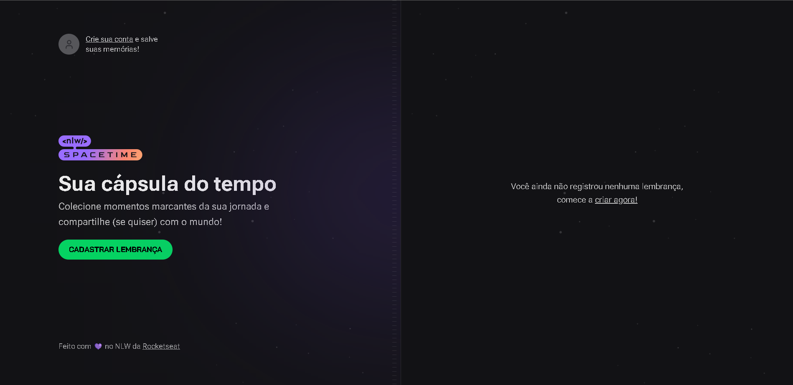

# Nlw Spacetime

<div align="center">
	
  
</div>

## :dart: Objetivo

Projeto desenvolvido com o conteúdo estudado no evento NLW da Rocketseat.

## :hammer_and_wrench: Ferramentas

- [axios](https://www.npmjs.com/package/axios)
- [dayjs](https://www.npmjs.com/package/dayjs)
- [next](https://nextjs.org/)
- [js-cookie](https://www.npmjs.com/package/js-cookie)
- [jwt-decode](https://www.npmjs.com/package/jwt-decode)
- [lucide-react](https://lucide.dev/)
- [tailwindcss](https://tailwindcss.com/)
- [typescript](https://www.typescriptlang.org/)

## :desktop_computer: Padronização de código

- [Eslint](https://eslint.org/)
- [Prettier](https://prettier.io/)

## :rocket: Executando o projeto

```bash
// Instale as dependências

npm i

// Concluindo a instalação rode

npm run dev
```
